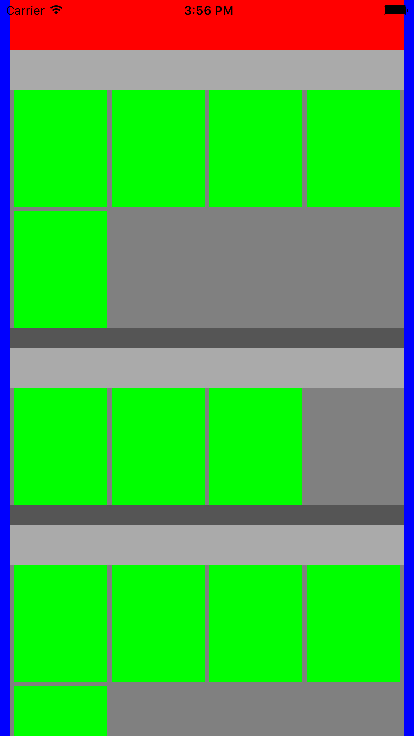

# JLCollectionViewEp
 关于UICollectionView使用的示例

## CollectionView 组成

*蓝色为整个CollectionView的背景色*

* Cell                -- 绿色区块
* Section Header View -- 浅灰色区块
* Section Fotter View -- 深灰色区块
* Decoration View     -- 灰色区块
